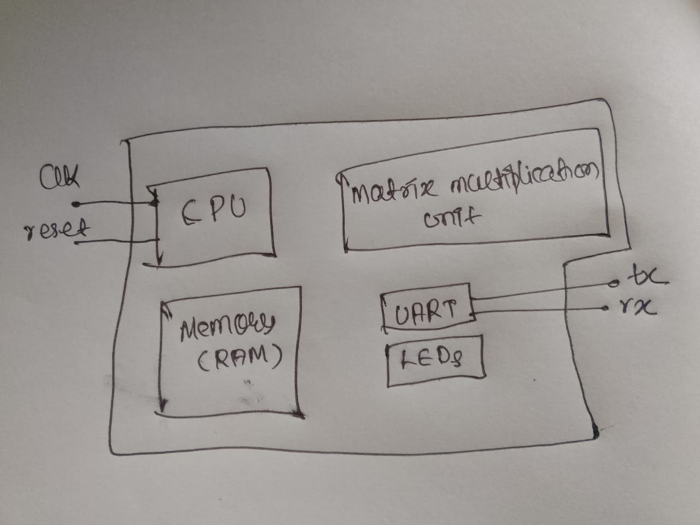
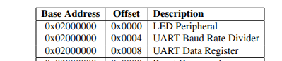

<ol>

<h1><li> Programming a Minimal SoC </h1>

In this chapter, we will revise the minimal SoC we had designed. Our SoC included a \textbf{systolic array} to accelerate matrix multiplication workloads. This SoC was implemented on an <b>Arty 7 FPGA board</b> . In this book, we will see how to program such a system.  

To program any embedded system, we need a few fundamental things that are common across all systems.  

<h2> Booting Example: Laptop, Computer, or Phone </h2>

Let us take an example of what happens when we turn on our laptop, computer, or phone.  

Our device has <b>firmware</b> hardcoded by the manufacturer. This firmware is stored in <b>ROM</b>, so it cannot be changed. The firmware makes all the hardware units ready and loads a program called the <b>bootloader</b>.  

<ul>
    <li> The bootloader then loads the <b>operating system (OS)</b>, if any, and configures various hardware components so they are available to the user.  </li>
    <li> The bootloader is stored in some <b>non-volatile memory</b>, such as EEPROM, SSD, or a disk.  </li>
</ul>

After the bootloader, if we have an OS, it transfers control to the OS. Otherwise, in bare-metal systems where there is no OS, it loads the <b> main program</b>, which then controls the execution.  

</li>

<h1><li>Our Minimal SoC </h1>

Now let's return to our SoC. It consists of:  

<ul>
    <li><b>Picorv32 core</b> </li>  
    <li><b>RAM</b> </li>  
    <li><b>UART</b> </li>  
    <li><b>LEDs</b> </li>
    <li><b>Matrix Multiplication Unit</b> </li>    
  
</ul>

To program an embedded system /SoC , you only need its <b> memory map </b>. This is because I/O peripherals are modeled as memory.  

So we can choose the memory map if we are the designers otherwise the vendor will provide you the details. In our case we are the designers so lets choose this memory map.

And our RAM will have range from 0x0000 to 0x10000.

Since we will not use an  OS here ,so this is a bare-metal system. Therefore, we need three main components:  

<ul>
    <li> Firmware  </li>
    <li> Bootloader  </li>
    <li> Main program  </li>
</ul>

<h2>Understanding Each Component</h2>

<h3>Firmware </h3>

Firmware is the low-level software that initializes and tests the hardware when the system is powered on. It is usually stored in <b>ROM</b> or <b>Flash memory</b> and is responsible for making sure all hardware blocks (CPU, RAM, UART, peripherals, etc.) are ready to use.  

<ul>
    <li>In our SoC, the firmware will configure the Picorv32 core, initialize the RAM, set the initial states of LEDs, and prepare the matrix multiplication unit.  </li>
    <li> Firmware is also responsible for loading the bootloader from non-volatile memory into RAM so that it can be executed.  </li>
</ul>

<h3>Bootloader </h3>

The bootloader is a small program whose main function is to <b> load the main program </b>into memory and then transfer control to it.  

<ul>
    <li> It can perform basic hardware setup that the firmware hasn’t done, such as configuring UART for debugging or setting up memory-mapped peripherals.  </li>
    <li> In some systems, the bootloader can provide features like firmware updates or self-test routines before starting the main program.  </li>
</ul>

<h3> Main Program </h3>

The main program is the user-level application that actually performs the tasks intended for the system.  

<ul>
    <li> In our bare-metal SoC, the main program will control the execution flow, read inputs from UART or other peripherals, and perform matrix multiplication using our accelerator.</li>
    <li> It directly interacts with the memory-mapped peripherals using the memory addresses defined in the memory map.</li>

</ul>

</ol>